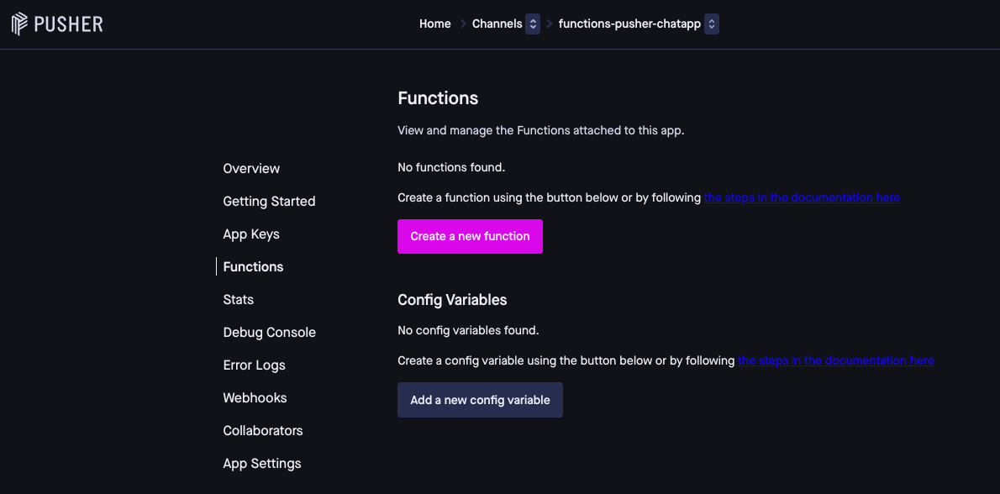
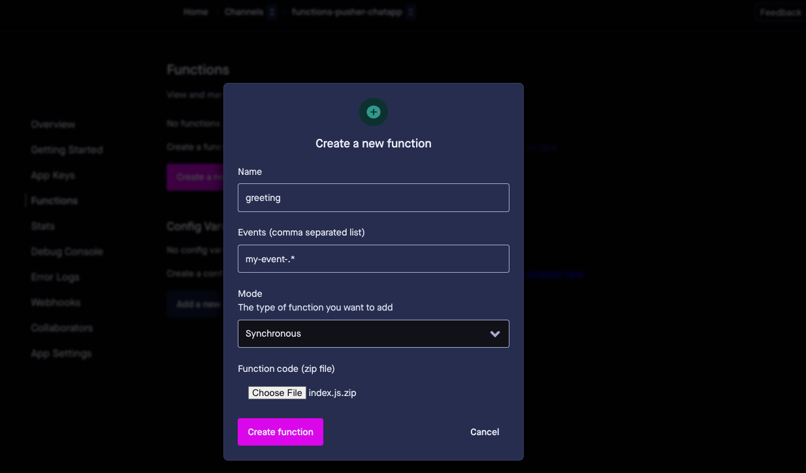
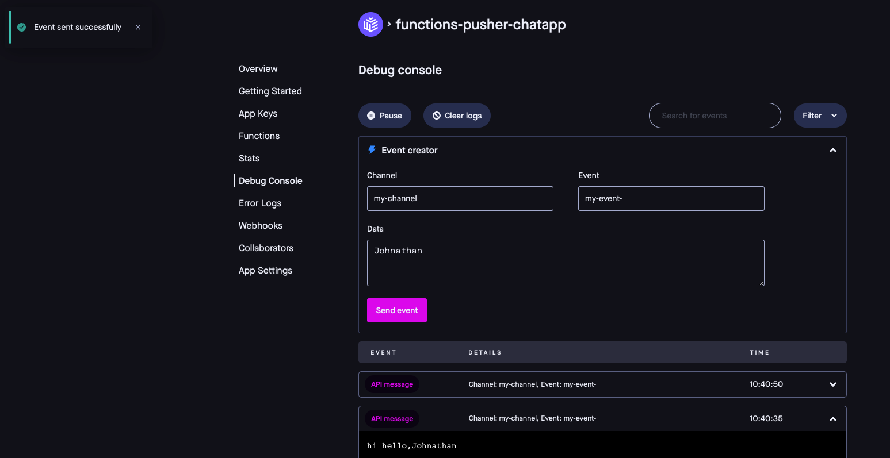

# Functions

Pusher Serverless Functions allow developers to respond programmatically to Channels events. Use them to modify, filter, alter events, and carry out additional tasks upon delivering those events without having to manage your own infrastructure.

## Types of functions

There are two ways you can use functions:

-   **Synchronous** - Functions that operate on events before the event is published to subscribers. Use cases include filtering and enriching messages.
    
-   **Asynchronous** - Functions that operate on events  after the event was published to subscribers. Use cases include integrations with other platforms.

## Using functions
There are two ways you can manage Pusher Serverless Functions:

- through the the Pusher dashboard,

- using the Pusher CLI.

Using either the dashboard or the CLI you can: 

- Create, update, and delete functions

- Live stream your functions logs*

- Manage your config variables
> **NOTE**
> 
> *Live streaming Function logs is not possible in the CLI currently and only exists in the Pusher dashboard. Through the Pusher CLI you can only view logs.

## Write functions

To get started, write your function code tailored to your use case. 
A Channels Serverless Function comprises an exported JavaScript event handler function named `handler` and potentially other supporting JavaScript functions which may reside in different files. Ensure the event handler is in a local file named `index.js`, and that all the supporting files are in a directory tree rooted at the same directory as the handler. For example:
```
myfunction
├── index.js
├── tools.js
└── utils
    └── more_tools.js
```

> **NOTE**
> The event handler is called with a pusher object. This object has the following properties:
> - **pusher.data** - This is the payload supplied to the event. (The data to be sent with the event. This will be converted to JSON by the library.)  
> - **pusher.event** - The channels event name
> - **pusher.channel** - The channels channel name

### Synchronous functions

The event handler will be invoked on an event **before** the event gets published to subscribers. The handler must return a new version of the event data. Then that event data will be delivered to subscribers.

Here’s an example of a function which modifies the event before it's published:

```js
exports.handler = async function (pusher)  {
    var data = pusher.data
    // modify data
    data = "hello, " + data
    return pusher.ok(data)
};
```

>**NOTE**
>
>If a synchronous function fails then the message will not be published. 

### Asynchronous functions

Here’s an example of a function that does extra work after the event is published:

```js
const axios = require("axios");

exports.handler = async (pusher) => {
  var data = pusher.data;
  
  // Perform some action with the data
  await axios.post('http://example.pusher.com', data);
};
```

If you are using the Pusher CLI, skip to [Functions in Pusher CLI](https://pusher.com/docs/channels/using_channels/functions/#functions-in-pusher-cli).

If you are using the Pusher dashboard, when you’re finished writing your function, compress it into a .zip file making sure that the `index.js` file is in the root level, and then upload it via the dashboard following the steps below.

## Functions in the Pusher dashboard

1. To get started with Pusher Channels, [sign in](https://dashboard.pusher.com/accounts/sign_in) to your Pusher account. If you don’t have one, [sign up](https://dashboard.pusher.com/accounts/sign_up) for a free account.
2. Choose the Channels app you wish to add functions to.
3. On the left-side navigation, go to **Functions** and click **Create a new function**.



4. Provide a name for your new function and determine which events should trigger the function. The function needs to know which events to respond to. You provide this as a comma-separated list, where each item is a regular expression. This pattern can match one or multiple event names. Then choose what kind of function it is (synchronous or asynchronous), and finally upload a .zip file of your function code.



5. Finally upload a .zip file of your function code. Click **Create function**. Make sure the event handler is in a local file named index.js, and that all the supporting files are in a directory tree rooted at the same directory as the handler. For example:
```
myfunction.zip
├── index.js
├── tools.js
└── utils
 └── more_tools.js
```

### Manage functions

To edit or delete your function, click the three dots.

To update a Function, edit the function's code on your computer, then upload it again through the Pusher dashboard.

After you delete a function, it won't be invoked to its linked events in Channels anymore.


### Configuration variables

To use secret or plaintext configuration variables with you functions, click Add a new config variable.

Functions can use config variables, either secret or in plain text. You can use it as a secure storage for important data, like third-party API keys. When setting one up, give it a unique name. This name lets you easily use or "call" the key in your functions.

Secret and plaintext configuration variables are available to all the functions in a Channels app.

### Triger functions

Define a condition cause for the function to run. Click **Trigger Function** and format this data based on the function's requirements.

### Invoke functions

To test out whether your function works as intended, go to the Debug Console and use a test event. If it works well, use it with actual Channels events.



You can check the function's activity and performance under the **Stats** tab in the Pusher dashboard.

## Functions in Pusher CLI

You can also deploy and manage your functions using the Pusher CLI. Check out the [How to install the Pusher CLI](https://pusher.com/docs/channels/pusher_cli/installation/) and [How to set up the Pusher CLI](https://pusher.com/docs/channels/pusher_cli/documentation/) articles for more information.

Through the Pusher CLI, you can edit, update, delete, and list all functions per app using the --app-id flag or use it to manage secret or plaintext configuration variables.

### Deploy a function

A function may be deployed using the [Pusher CLI](/docs/channels/pusher_cli/overview/) by providing a path to the directory holding the `index.js` file as an argument. Flags are required to specify the app ID, function name, the events the function should handle and the function's mode (synchronous or asynchronous). The events flag takes a comma separated list of regular expressions, each of which can match multiple event names.

The `mode` indicates if the function is synchronous or asynchronous, and defaults to `asynchronous` if the flag isn’t supplied.
    
```
pusher channels apps functions create ./myfunction \
  --app-id <YOUR_APP_ID> \
  --name "my-function" \
  --events "my-event" \
  --mode synchronous
```

### View and edit deployed functions

To retrieve a list of deployed functions, use the Pusher CLI with this command:

`pusher channels apps functions list --app-id <YOUR_APP_ID>`

This returns the function name, mode, and event patterns for each deployed function on your Channels account.

To edit existing functions, you’ll need to know the function name.

### Update functions

To update an existing function, edit the JavaScript code locally and then redeploy it using the [Pusher CLI](/docs/channels/pusher_cli/overview/). This can also be used to change the other parameters (events, name, mode, etc.)

```
pusher channels apps functions update "my-function" ./myfunction \
  --app-id <YOUR_APP_ID> \
  --name "my-renamed-function" \
  --events "my-event,my-other-event"
 ```

### Delete functions

Use this command to delete a function from your Channels account (local copies are unaffected).

Once you delete it, the function will no longer be invoked when a matching event is published to Channels.

`pusher channels apps functions delete "my-function" --app-id < YOUR_APP_ID>`

### View function logs

You can view log output for each function using the Pusher CLI.

`pusher channels apps functions logs "my-function" --app-id <YOUR_APP_ID>`

> **NOTE**
>
>There can be a ~5 min delay before logs become available.

### Secret or plaintext configuration variables

Functions supports secret or plaintext config variables for use with your functions. For example, you could store a third-party API key to access an additional service.

You can store these API keys securely with Pusher and access them in a function. Give each config variable a name to reference in your function and specify its contents. For example:

```
pusher channels apps functions configs create \
  --name MYSECRET \
  --description "A secret param" \
  --content "my-secret" \
  --app-id <YOUR_APP_ID> \
  --type "secret"
  ```

Secret and plaintext configuration variables are available to all the functions in a Channels app.

#### Configuration variables with functions

here's an example on how to access a config variable from a function:

```
exports.handler = async function (pusher) {
  var secretValue = await pusher.getConfig('MYSECRET');
  // use secret with 3rd-party service
};
```

#### View config variables

To view config variables, use the [Pusher CLI](/docs/channels/pusher_cli/overview/).

`pusher channels apps functions configs list --app-id <YOUR_APP_ID>`

#### Update config variables

To update an existing config variable, use the [Pusher CLI](/docs/channels/pusher_cli/overview/).

```
pusher channels apps functions configs update MYSECRET \
  --app-id <YOUR_APP_ID> \
  --content "my-updated-secret" \
  --description "A secret param"
  ```

#### Delete config variables

To delete a config variable, use the [Pusher CLI](/docs/channels/pusher_cli/overview/).

Once you delete it, the config variable will no longer be available to any of your existing Pusher functions.

`pusher channels apps functions configs delete "MYSECRET" --app-id <YOUR_APP_ID>`

### Invoke functions

To test your function you can invoke it using [Pusher CLI](/docs/channels/pusher_cli/overview/). This sends a test event and returns the function output.

If the function is synchronous, the following command waits and outputs the value returned from the function:

```
pusher channels apps functions invoke "my-function" \
  --app-id <YOUR_APP_ID> \
  --data "test data" \
  --event "my-event" \
  --channel "my-channel"
```

Now, if the test was successful, invoke the function for real from a Channels event:

```
pusher channels apps trigger \
  --app-id <YOUR_APP_ID> \
  --channel "my-channel" \
  --event "my-event" \
  --message "my event body"
  ```
  
Once done, you can monitor function invocation rate for your app under the [Stats tabs](https://dashboard.pusher.com/stats) in the Pusher dashboard.

## Triggering multiple functions
An event may trigger multiple functions. In that case, the asynchronous functions will be invoked immediately, each taking the original event data.
The synchronous functions will be chained in alphabetical order by their name, where the output of the first function will serve as the input to the second function, and so on.

## Limitations
- There are limitations on using Functions with system events (i.e., events that originate from within the Pusher ecosystem rather than directly from customers or their users). Firstly, Functions can only be used with a defined subset of channel events. Secondly, channel events can only trigger asynchronous functions.
Channel events that can be used with asynchronous functions are:
    -   **pusher:cache_miss**
    -   **pusher:signin_success**
    -   **pusher:connection_established**
    -   **pusher_internal:subscription_count**
    -   **pusher_internal:subscription_succeeded**
    -   **pusher_internal:watchlist_events**
    -   **pusher_internal:member_added**
    -   **pusher_internal:member_removed**

- Functions run on an ARM64 chipset. This may influence the compilation requirements of any dependencies you include. Feel free to reach out to our [Support team](https://support.pusher.com/hc/en-us/requests/new) for any further information or guidance.

## Pricing

Pusher Serverless Functions call usage is rolled up into your existing Pusher Channels subscription, with 1 function call equal to 50 Pusher Channels messages. Each function call is limited to memory usage of 512 MB. Average function execution times are expected to be 500ms or less. A maximum theoretical execution time of 1 second is possible but additional charges may apply.

For initial configuration, each account is allocated a maximum of 10 functions.

Should your memory, execution duration or function number requirements exceed these settings, you can [contact us](https://pusher.com/contact/) to speak about custom functions plans or reach out to your dedicated Customer Success Manager.
